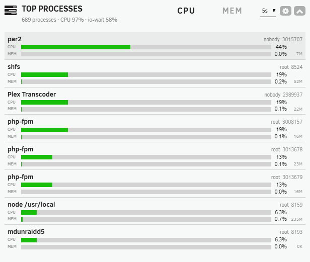

# Top Processes — Unraid Dashboard Widget

A native-looking **Dashboard tile for Unraid 7.x** that shows the processes using the
most CPU and memory — like `htop`, but in Unraid's style. It fills the gap left by the
official Processor and System tiles, which tell you *how much* is used but never *which
process* is responsible.

<p align="center">
  
</p>

```
 dockerd                       root   1234
 CPU ███████████████░░░░░░░░░░░░░  42%
 MEM ██████░░░░░░░░░░░░░░░░░░░░░░  18% 512M
 shfs                          root    987
 CPU ████████████████████████████  78%
 MEM ██████████████░░░░░░░░░░░░░░  41% 1.2G
```

## Features

- **Top‑N processes** with name, user and PID (full command line on hover).
- **Twin CPU + RAM bars** per process — two flat, square, full‑width rails that match
  Unraid's native usage bars; distinguished by a `CPU` / `MEM` label, with colour used
  only for severity (green → orange → red), plus **absolute memory** (e.g. `1.2G`).
- **Sort by CPU or MEM** from the header tabs; **native refresh selector** (2 / 5 / 10 s
  / off) just like the Processor tile's “30 s” dropdown.
- **Accurate %CPU** from `/proc` (htop/Irix — 100 % = one core), **including kernel
  threads** (ZFS, md, kworker…) so the real culprit shows — not the misleading dashboard
  average. A header readout (`CPU X% · io‑wait Y%`) reconciles with the official Processor
  tile and surfaces disk‑wait (which belongs to no process). Kernel threads are toggleable
  in Settings.
- **Themes:** tracks white / black / gray / azure via Unraid's CSS tokens.
- **Light on resources:** a stateful endpoint does a single `/proc` walk and computes
  CPU as a delta (no blocking sleep); the tile polls **only while it's visible and
  expanded** (pauses when collapsed, off‑screen, or the tab is hidden). No background
  daemon.

## Install

Unraid → **Plugins → Install Plugin** → paste:

```
https://raw.githubusercontent.com/JanitorHead/unraid-topprocesses/master/topprocesses.plg
```

Then open the **Dashboard** — the *Top Processes* tile appears in the left column.
Defaults (rows, sort, interval) live in **Settings → Utilities → Top Processes**.
The plugin is self‑contained (every file embedded inline) and auto‑updates from this repo.

## How %CPU is measured

Computed from `/proc` using htop's Irix semantics, so 100 % means one full core. This
avoids the well‑known “100 % in the dashboard, 15 % in htop” discrepancy. Cross‑check on
the console with `top -bn1 -o %CPU | head -n 20`.

## Building / contributing

`topprocesses.plg` is **generated** from `source/` — never hand‑edit it. After changing
anything under `source/topprocesses/…`, regenerate with a new version:

```bash
build/make-standalone-plg.sh     # writes topprocesses.plg from source/ (version = today's date)
```

Fastest iteration on a live box (skip packaging): copy the staging tree onto the server
and refresh the Dashboard:

```bash
scp -r source/topprocesses/usr/local/emhttp/plugins/topprocesses root@TOWER:/usr/local/emhttp/plugins/
```

## License

[MIT](LICENSE).
